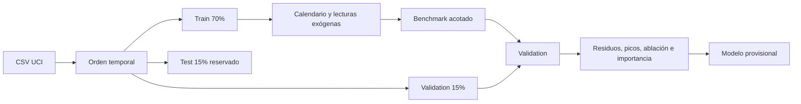

# Flujo reproducible del Corte 2

```mermaid
flowchart LR
  A[CSV UCI] --> B[Orden temporal]
  B --> C[Train 70%]
  B --> D[Validation 15%]
  B --> E[Test 15% reservado]
  C --> F[Calendario y lecturas exógenas]
  F --> G[Benchmark acotado]
  G --> H[Validation]
  D --> H
  H --> I[Residuos, picos, ablación e importancia]
  I --> J[Modelo provisional]
```

Test no interviene antes de Corte 3.
